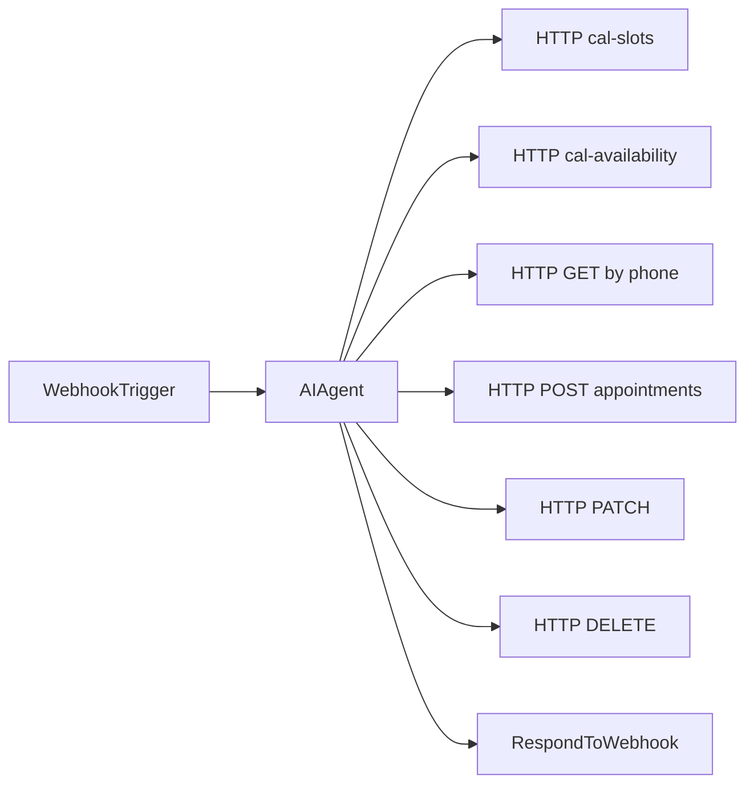

# n8n AI Scheduler Workflow

This guide describes how to connect the BrightSmile site chat widget to an n8n workflow that handles booking, rescheduling, and cancellation.

## Architecture

```
User → Chat Widget → POST /api/chat → n8n Webhook → AI Agent → Appointment APIs → Supabase + Cal.com
```

The Next.js app proxies chat messages so your n8n webhook URL stays server-side only.

## Environment setup

In `.env.local` on the Next.js app:

```env
N8N_SCHEDULER_WEBHOOK_URL=https://your-n8n.example.com/webhook/scheduler
N8N_SCHEDULER_WEBHOOK_SECRET=your-shared-secret
APPOINTMENT_API_SECRET=your-api-secret
```

In n8n, verify incoming requests using the `X-Webhook-Secret` header if configured.

Set your deployed app URL in n8n HTTP Request nodes, e.g. `https://your-site.com`.

## Webhook trigger

Create a **Webhook** node:

- **Method:** POST
- **Path:** `scheduler` (or any path you prefer)
- **Response mode:** When last node finishes

**Expected input from `/api/chat`:**

```json
{
  "message": "I need to book a cleaning",
  "sessionId": "550e8400-e29b-41d4-a716-446655440000",
  "history": [
    { "role": "user", "content": "Hi" },
    { "role": "assistant", "content": "Hello! How can I help?" }
  ]
}
```

## AI Agent system prompt

Use this as a starting system prompt for your AI Agent node:

```
You are the BrightSmile Dental schedule assistant. Help patients book, reschedule, or cancel appointments.

Clinic rules:
- Hours: Monday–Friday, 8:00–11:00 AM and 1:00–4:00 PM (Asia/Manila)
- Lunch break 12:00–1:00 PM — no bookings
- Booking window: tomorrow through 30 days ahead
- Weekends are closed

Before booking, collect: full name, phone number, preferred branch, service, date, and time.
Before cancel/reschedule, look up appointments by phone number and confirm which appointment to change.

Branches:
- sm-southmall — SM Southmall, Las Piñas
- sm-megamall — SM Megamall, Mandaluyong

Services: Dental Cleaning, Fillings & Restorations, Teeth Whitening, Root Canal Therapy, Orthodontics, Emergency Care

Always confirm details before creating, rescheduling, or cancelling.
Use friendly, concise language. Times are in Philippine time (PHT).
```

## HTTP Request tools for the AI Agent

Configure each tool as an HTTP Request node (or use n8n AI Agent tool definitions).

**Auth header for all appointment tools:**

```
Authorization: Bearer {{ $env.APPOINTMENT_API_SECRET }}
```

Replace `{{ $env.APPOINTMENT_API_SECRET }}` with your secret or use n8n credentials.

### 1. listOpenDays

```
GET {{APP_URL}}/api/cal-availability?from=2026-07-03&to=2026-07-10
```

Returns `{ dates: { "2026-07-03": 3 } }` — number of open slots per day.

### 2. checkAvailability

```
GET {{APP_URL}}/api/cal-slots?date=2026-07-03
```

Returns `{ availableHours: [8, 9, 13], slotTimes: { "9": "2026-07-03T09:00:00+08:00" } }`.

Use `slotTimes[hour]` as `slotIso` when booking for Cal.com accuracy.

### 3. findAppointments

```
GET {{APP_URL}}/api/appointments?phone=+639171234567
Authorization: Bearer {{APPOINTMENT_API_SECRET}}
```

Returns upcoming confirmed appointments for that phone number.

### 4. bookAppointment

```
POST {{APP_URL}}/api/appointments
Authorization: Bearer {{APPOINTMENT_API_SECRET}}
Content-Type: application/json

{
  "appointmentDate": "2026-07-03",
  "startHour": 9,
  "clinicLocationId": "sm-southmall",
  "patientName": "Juan Dela Cruz",
  "patientPhone": "+639171234567",
  "patientEmail": "",
  "service": "Dental Cleaning",
  "slotIso": "2026-07-03T09:00:00+08:00"
}
```

### 5. rescheduleAppointment

```
PATCH {{APP_URL}}/api/appointments/{id}
Authorization: Bearer {{APPOINTMENT_API_SECRET}}
Content-Type: application/json

{
  "appointmentDate": "2026-07-04",
  "startHour": 14,
  "slotIso": "2026-07-04T14:00:00+08:00"
}
```

### 6. cancelAppointment

```
DELETE {{APP_URL}}/api/appointments/{id}
Authorization: Bearer {{APPOINTMENT_API_SECRET}}
```

## Respond to Webhook

The last node must return JSON the chat widget understands:

```json
{
  "reply": "Your appointment is confirmed for July 3 at 9:00 AM at SM Southmall."
}
```

If using an AI Agent node, map its text output to the `reply` field in a **Set** node before **Respond to Webhook**.

## Optional: session memory

Add a **Simple Memory** node (or Redis/chat memory) keyed on `{{ $json.sessionId }}` so multi-turn conversations stay coherent across messages.

The client also sends `history` (last messages) which you can pass directly to the AI model as context.

## Workflow diagram



## Testing locally

1. Run n8n locally or use n8n Cloud
2. Activate the workflow and copy the webhook URL
3. Set `N8N_SCHEDULER_WEBHOOK_URL` in `.env.local`
4. Run `npm run dev` and open the chat icon (bottom-right)
5. Send a test message — n8n should receive the payload

For appointment API testing without the AI, use curl:

```bash
curl -H "Authorization: Bearer YOUR_SECRET" \
  "http://localhost:3000/api/appointments?phone=%2B639171234567"
```

## Database migration

Run the Supabase migration to add Cal.com booking UID storage:

```
supabase/migrations/005_cal_booking_uid.sql
```

This adds `cal_booking_uid` column required for Cal.com cancel/reschedule sync.
