# n8n AI Scheduler Workflow

This guide describes how to connect the BrightSmile site chat widget to an n8n workflow that handles booking, rescheduling, and cancellation.

## Architecture

```
User → Chat Widget → POST /api/chat → n8n Webhook → AI Agent → Appointment APIs → Supabase + Cal.com
```

Availability tools (`/api/cal-slots`, `/api/cal-availability`) use **local clinic hours + Supabase** (fast). Create/cancel/reschedule write to **Cal.com** then Supabase.

The Next.js app proxies chat messages so your n8n webhook URL stays server-side only.

Free hosting (Vercel + free n8n): see [free-hosting.md](./free-hosting.md).

## Environment setup

In `.env.local` on the Next.js app:

```env
N8N_SCHEDULER_WEBHOOK_URL=https://your-n8n.example.com/webhook/scheduler
N8N_SCHEDULER_WEBHOOK_SECRET=your-shared-secret
APPOINTMENT_API_SECRET=your-api-secret
NEXT_PUBLIC_CAL_LINK=your-username/your-event-slug
CAL_API_KEY=cal_live_...
```

In n8n, verify incoming requests using the `X-Webhook-Secret` header if configured.

Set your deployed app URL in n8n HTTP Request nodes, e.g. `https://your-site.vercel.app`.

## Webhook trigger

Create a **Webhook** node:

- **Method:** POST
- **Path:** `scheduler` (or any path you prefer)
- **Response mode:** When last node finishes

**Expected input from `/api/chat`:**

```json
{
  "message": "I need to book a cleaning",
  "sessionId": "550e8400-e29b-41d4-a716-446655440000"
}
```

## Stable contract (keep this stable for future n8n workflows)

The Next.js proxy forwards the following JSON to your n8n webhook:

Request keys:
- `message` (string, 1–2000 chars)
- `sessionId` (optional UUID — required for Simple Memory continuity)

Your n8n workflow should respond with JSON:
- `reply` (string, preferred)
- `message` (string, accepted as a fallback for `reply`)

Auth:
- If `N8N_SCHEDULER_WEBHOOK_SECRET` is set in the Next.js app, the proxy includes `X-Webhook-Secret` in the webhook request header.

## AI Agent system prompt

Paste this into your AI Agent system message. Keep it as the single source of clinic rules.

```
You are BrightSmile Dental’s appointment scheduling assistant.

Help patients book, reschedule, cancel, or check available times.

Current date and time: {{ $now.setZone('Asia/Manila').toFormat('yyyy-MM-dd HH:mm') }} PHT

Rules:
Use Asia/Manila (PHT) for all dates and times.
Reply in plain text only. No Markdown, asterisks, bullets, numbered lists, tables, JSON, or code.
Be friendly, concise, and clear.
Never invent appointment ids, slotIso values, availability, or tool results.
Never expose tool names, API errors, UUIDs, or system details to the patient.
Never book dates in the past.
Only book from tomorrow through 30 calendar days from today, inclusive.
Closed Saturday and Sunday.
Bookable start times Monday to Friday: 8:00 AM, 9:00 AM, 10:00 AM, 11:00 AM, 1:00 PM, 2:00 PM, 3:00 PM, 4:00 PM.
Do not offer or book 12:00 PM to 1:00 PM.
Treat checkAvailability results as the final authority for open times.
Call each availability tool at most once per patient question unless the patient changes the date.
Do not call book, reschedule, or cancel tools until the patient clearly confirms a summary you just showed.

Branches (use clinicLocationId values exactly when booking):
sm-southmall = SM Southmall, Las Piñas
sm-megamall = SM Megamall, Mandaluyong

Services:
Dental Cleaning
Fillings & Restorations
Teeth Whitening
Root Canal Therapy
Orthodontics
Emergency Care

Phone:
Accept 09… or +63 9… formats.
Normalize to 10 digits 9XXXXXXXXX before findAppointments or bookAppointment.
Example: 09171234567 or +639171234567 becomes 9171234567.

Tool parameters (strict — extra fields cause failures):
listOpenDays: only from, to (YYYY-MM-DD). Never pass branch, service, id, or phone.
checkAvailability: only date (YYYY-MM-DD). Never pass branch, service, id, phone, or time.
findAppointments: only phone.
bookAppointment: appointmentDate, startHour, clinicLocationId, patientName, patientPhone, service, and slotIso from checkAvailability. Optional patientEmail.
rescheduleAppointment: only id, appointmentDate, startHour, and slotIso from checkAvailability.
cancelAppointment: only id.
Branch and service are for booking only. Never send them to availability tools.
Use appointment id only from findAppointments. Never invent ids or use call_ ids.
Use slotIso exactly as returned in checkAvailability slotTimes. Never invent slotIso.
startHour is the hour number (8, 9, 10, 11, 13, 14, 15, or 16).

Booking:
Collect full name, phone, clinicLocationId, service, date, and time.
Validate weekday, booking window, and bookable start times.
If checking a range of days, call listOpenDays with from and to.
Then call checkAvailability with only the chosen date.
If the requested time is unavailable, offer only times returned by checkAvailability.
Show a short summary and ask for explicit confirmation.
Only after confirmation, call bookAppointment with the collected details and exact slotIso.
On success, confirm branch, service, date, and time in plain sentences.

Reschedule:
Ask for phone, normalize it, then call findAppointments.
If several appointments, ask which one by stating branch, service, date, and time.
If one appointment, state it and ask if that is the one to reschedule.
Collect new date and time, validate, then call checkAvailability with only the new date.
Show old and new details, ask for confirmation.
Only after confirmation, call rescheduleAppointment with the existing id and exact slotIso.
On success, confirm the new details.

Cancel:
Ask for phone, normalize it, then call findAppointments.
Confirm which appointment, then ask for explicit cancellation confirmation.
Only after confirmation, call cancelAppointment with that id.
Only say the appointment was cancelled if cancelAppointment returned HTTP 200 success.
If cancel returns 404 or not found, say you could not cancel it and offer to look up appointments again. Do not claim it was cancelled.
If another tool failure occurs, apologize briefly and say you cannot complete the request right now.

Confirmation:
Yes, confirm, go ahead, or clear approval counts only when it directly follows your summary.
If the patient changes any detail after that, show a new summary and confirm again.

If information is missing, ask only for the next missing detail.

Output:
Plain text only.
Short sentences separated by line breaks.
No Markdown, asterisks, hashtags, backticks, underscores used for formatting, brackets for links, HTML, tables, JSON, bullets, or numbered lists.
Do not add generic closings like “If you need further assistance”.
```

## HTTP Request tools for the AI Agent

Configure each tool as an HTTP Request Tool on the AI Agent. Use short descriptions (below) and define **only** the listed `$fromAI` keys — extra fields cause `additionalProperties … not allowed`.

**Important (n8n 1.90+ / `httpRequestTool`):** do **not** use `{placeholder}` in the body/URL. That literal string is sent to the API. Use `$fromAI(...)` expressions instead (or click ✨ on each field). Set the JSON body editor to **Expression** mode when pasting.

**Auth header for appointment tools (3–6):**

```
Authorization: Bearer {{APPOINTMENT_API_SECRET}}
```

### Tool descriptions (paste into n8n)

**1. listOpenDays**
```
List how many open appointment slots exist for each day in a date range. Inputs: from (YYYY-MM-DD), to (YYYY-MM-DD) only. Do not pass branch, service, id, phone, or time. Prefer a short range such as 7 days.
```
- Method: `GET`
- URL: `={{ $env.APP_URL }}/api/cal-availability?from={{ $fromAI('from', 'Start date YYYY-MM-DD', 'string') }}&to={{ $fromAI('to', 'End date YYYY-MM-DD', 'string') }}`
- `$fromAI` keys: `from`, `to`

**2. checkAvailability**
```
Check open hours for one date. Input: date (YYYY-MM-DD) only. Do not pass branch, service, id, phone, or time. Returns availableHours and slotTimes. Use slotTimes[hour] as slotIso when booking or rescheduling.
```
- Method: `GET`
- URL: `={{ $env.APP_URL }}/api/cal-slots?date={{ $fromAI('date', 'Date YYYY-MM-DD', 'string') }}`
- `$fromAI` keys: `date`

**3. findAppointments**
```
Find upcoming confirmed appointments by patient phone. Input: phone only (09…, +63 9…, or 9XXXXXXXXX). Returns appointment id, date, time, service, and notes/branch. Use this before reschedule or cancel. Do not invent ids.
```
- Method: `GET`
- URL: `={{ $env.APP_URL }}/api/appointments?phone={{ $fromAI('phone', 'Patient phone 09… or 9XXXXXXXXX', 'string') }}`
- Headers: Authorization Bearer
- `$fromAI` keys: `phone`

**4. bookAppointment**
```
Create a confirmed appointment after the patient explicitly confirms a summary. Inputs only: appointmentDate (YYYY-MM-DD), startHour (8|9|10|11|13|14|15|16), clinicLocationId (sm-southmall|sm-megamall), patientName, patientPhone (normalized 9XXXXXXXXX), service (exact service name), slotIso (exact value from checkAvailability slotTimes). Optional: patientEmail. Do not call until confirmation.
```
- Method: `POST`
- URL: `{{APP_URL}}/api/appointments/book` (or `/api/appointments`)
- Headers: Authorization Bearer, Content-Type application/json
- JSON body (Expression mode):

```json
{
  "appointmentDate": "{{ $fromAI('appointmentDate', 'YYYY-MM-DD', 'string') }}",
  "startHour": "{{ $fromAI('startHour', 'Hour 8|9|10|11|13|14|15|16', 'number') }}",
  "clinicLocationId": "{{ $fromAI('clinicLocationId', 'sm-southmall or sm-megamall', 'string') }}",
  "patientName": "{{ $fromAI('patientName', 'Full name', 'string') }}",
  "patientPhone": "{{ $fromAI('patientPhone', 'Normalized 9XXXXXXXXX', 'string') }}",
  "patientEmail": "{{ $fromAI('patientEmail', 'Optional email', 'string') }}",
  "service": "{{ $fromAI('service', 'Exact service name', 'string') }}",
  "slotIso": "{{ $fromAI('slotIso', 'Exact slotIso from checkAvailability', 'string') }}"
}
```

**5. rescheduleAppointment**
```
Reschedule an existing appointment after explicit confirmation. Inputs only: id (UUID from findAppointments), appointmentDate (full YYYY-MM-DD, never truncated), startHour (8|9|10|11|13|14|15|16), slotIso (exact value from checkAvailability). Example: appointmentDate 2026-07-31 with slotIso 2026-07-31T16:00:00+08:00. Do not pass branch, service, phone, or invented ids.
```
- Method: `POST`
- URL: `{{APP_URL}}/api/appointments/reschedule`
- Headers: Authorization Bearer, Content-Type application/json
- JSON body (Expression mode):

```json
{
  "id": "{{ $fromAI('id', 'UUID from findAppointments', 'string') }}",
  "appointmentDate": "{{ $fromAI('appointmentDate', 'YYYY-MM-DD only, not ISO datetime', 'string') }}",
  "startHour": "{{ $fromAI('startHour', 'Hour 8|9|10|11|13|14|15|16', 'number') }}",
  "slotIso": "{{ $fromAI('slotIso', 'Exact slotIso from checkAvailability', 'string') }}"
}
```

**6. cancelAppointment**
```
Cancel an existing appointment after explicit confirmation. Input: id only (UUID from findAppointments). Do not invent ids. Only treat as cancelled on HTTP 200 success.
```
- Method: `POST`
- URL: `{{APP_URL}}/api/appointments/cancel`
- Headers: Authorization Bearer, Content-Type application/json
- JSON body (Expression mode):

```json
{
  "id": "{{ $fromAI('id', 'UUID from findAppointments', 'string') }}"
}
```

### Prefer body-based cancel / reschedule (n8n-friendly)

Path params like `/appointments/{id}` are easy to misconfigure in n8n HTTP Request Tool. Use these instead:

**Cancel (POST body):**
```
POST {{APP_URL}}/api/appointments/cancel
Authorization: Bearer {{APPOINTMENT_API_SECRET}}
Content-Type: application/json

{ "id": "<appointment-uuid-from-findAppointments>" }
```

**Book (POST body):**
```
POST {{APP_URL}}/api/appointments/book
Authorization: Bearer {{APPOINTMENT_API_SECRET}}
Content-Type: application/json

{
  "appointmentDate": "2026-07-03",
  "startHour": 9,
  "clinicLocationId": "sm-southmall",
  "patientName": "Juan Dela Cruz",
  "patientPhone": "9171234567",
  "patientEmail": "",
  "service": "Dental Cleaning",
  "slotIso": "2026-07-03T09:00:00+08:00"
}
```

**Reschedule (POST body):**
```
POST {{APP_URL}}/api/appointments/reschedule
Authorization: Bearer {{APPOINTMENT_API_SECRET}}
Content-Type: application/json

{
  "id": "<appointment-uuid>",
  "appointmentDate": "2026-07-04",
  "startHour": 14,
  "slotIso": "2026-07-04T14:00:00+08:00"
}
```

### Endpoint quick reference

#### listOpenDays
```
GET {{APP_URL}}/api/cal-availability?from=2026-07-03&to=2026-07-10
```
Returns `{ dates: { "2026-07-03": 3 } }` — open slot count per day.

#### checkAvailability
```
GET {{APP_URL}}/api/cal-slots?date=2026-07-03
```
Returns `{ availableHours: [8, 9, 13], slotTimes: { "9": "2026-07-03T09:00:00+08:00" } }`.

#### findAppointments
```
GET {{APP_URL}}/api/appointments?phone=9171234567
Authorization: Bearer {{APPOINTMENT_API_SECRET}}
```

#### bookAppointment / rescheduleAppointment / cancelAppointment
See body examples above.

## Respond to Webhook

The last node must return JSON the chat widget understands:

```json
{
  "reply": "Your appointment is confirmed for July 3 at 9:00 AM at SM Southmall."
}
```

If using an AI Agent node, map its text output to the `reply` field in a **Set** node before **Respond to Webhook**.

## Optional: session memory

Add a **Simple Memory** node keyed on `{{ $json.sessionId }}` so multi-turn stays coherent.

**Token / rate-limit tips (important for Groq free TPM):**

1. **Use Simple Memory only** for conversation context. The site no longer forwards a client `history` array — only `message` + `sessionId`. Keep Context Window Length around **4–6**.
2. Keep the system prompt short; long tool descriptions also count toward TPM.
3. Prefer `llama-3.1-8b-instant` for chat; save larger models for when needed.
4. If you still hit TPM limits, wait ~10s or upgrade Groq Dev tier — or rely on Gemini + Groq fallback.

A **New chat** action in the widget rotates `sessionId`, which starts a fresh memory thread in n8n.

## Workflow diagram

```mermaid
flowchart LR
  webhook[WebhookTrigger] --> agent[AIAgent]
  agent --> toolSlots[HTTP cal-slots]
  agent --> toolDays[HTTP cal-availability]
  agent --> toolLookup[HTTP GET by phone]
  agent --> toolBook[HTTP POST appointments]
  agent --> toolReschedule[HTTP PATCH]
  agent --> toolCancel[HTTP DELETE]
  agent --> respond[RespondToWebhook]
```



## Testing locally

1. Run n8n locally or use n8n Cloud
2. Activate the workflow and copy the webhook URL
3. Set `N8N_SCHEDULER_WEBHOOK_URL` in `.env.local`
4. Run `npm run dev` and open the chat icon (bottom-right)
5. Send a test message — n8n should receive the payload

For appointment API testing without the AI, use curl:

```bash
curl -H "Authorization: Bearer YOUR_SECRET" \
  "http://localhost:3000/api/appointments?phone=%2B639171234567"
```

## Database migration

Run the Supabase migration to add booking UID storage for scheduler cancel/reschedule:

```
supabase/migrations/005_cal_booking_uid.sql
```

This adds `cal_booking_uid` column required for cancel/reschedule sync.
